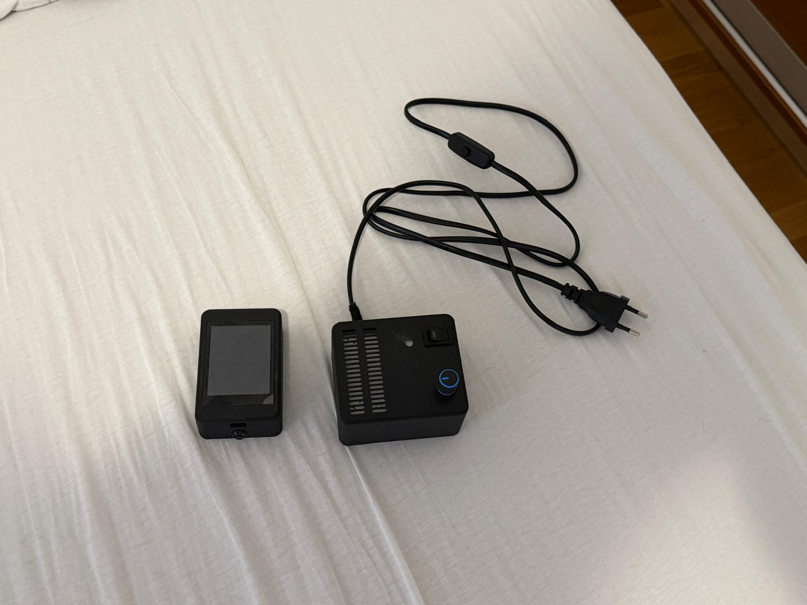
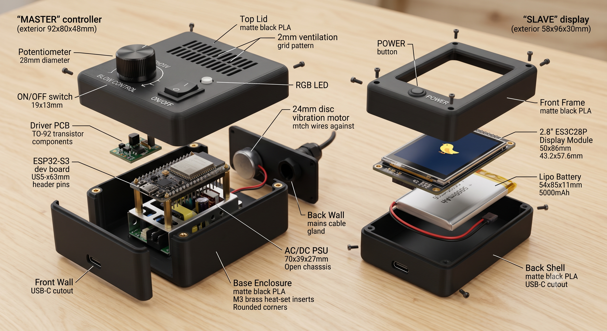
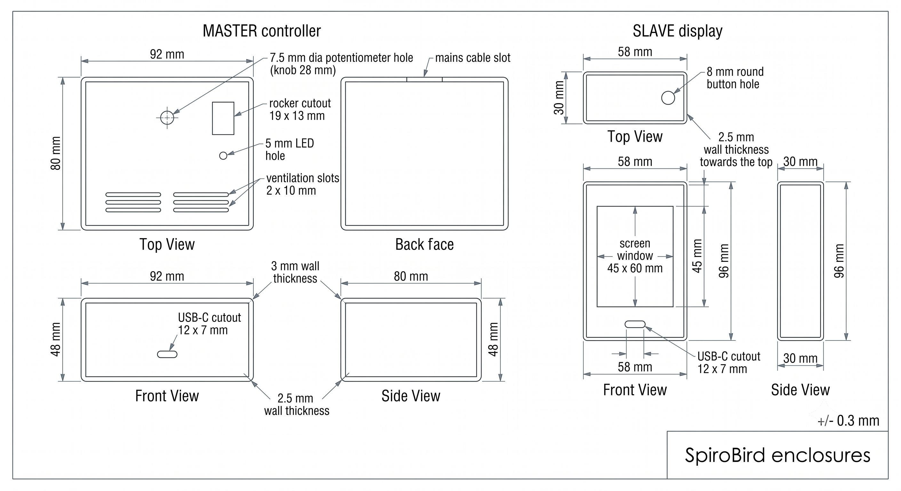

# SpiroBird — 3D printano kućište

Dva zasebna kućišta (matte crni PLA, 3D print): **MASTER** (kontroler/"puhalica")
i **SLAVE** (display). Dizajn je realiziran i sklopljen — uređaji rade u kućištima.

## Realizacija (isprintano i sklopljeno)

Video rada uređaja u kućištu: [`snimka-rada.mp4`](snimka-rada.mp4)

## Exploded view (raspored komponenti)

## Tehnički nacrt (ortogonalni pogledi)

---

## MASTER kućište — "puhalica" (kontroler)

**Vanjske dimenzije: 92 × 80 × 48 mm** (Š×D×V), stijenka 3 mm → unutarnje 86 × 74 × 42.
Dvodijelno: kutija + poklopac, M3 ugrijani mesing inserti.

Težak AC/DC PSU leži na dnu (nizak centar mase), ESP32 na distancnicima pokraj,
driver-pločica i vibro motor uz stražnju stijenku. **Potenciometar i rocker su na
gornjoj plohi** — prirodno za "puhanje" (korisnik gleda odozgo i okreće veliki knob).

| Element | Pozicija / mjera |
|---|---|
| Knob potenciometra (B10K) | gornja ploha, rupa ⌀7.5, knob ⌀28 — glavna kontrola |
| Rocker prekidač ON/OFF (KCD1) | gornja ploha, izrez 19 × 13 mm |
| RGB LED prozor | gornja ploha, ⌀5 mm |
| Ventilacija | prorezi 2 × 10 mm iznad PSU-a (grije se) |
| USB-C (ESP32) | prednja ploha, izrez 12 × 7 mm |
| Mrežni kabel (PSU) | stražnja ploha, prorez + rasterećenje |
| Vibro motor (⌀24) | pritisnut uz stijenku radi prijenosa vibracije |

Komponente: ESP32-S3 dev board (25.5×63), AC/DC PSU 5 V/1 A (70×39×27), B10K
potenciometar, 2N2222A driver pločica (30×20), vibro motor ⌀24.

## SLAVE kućište — display

**Vanjske dimenzije: 58 × 96 × 30 mm** (Š×V×D), stijenka 2.5 mm. Display je "lice";
baterija iza njega.

| Element | Pozicija / mjera |
|---|---|
| Otvor ekrana | 45 × 60 mm (aktivno 43.2 × 57.6), centriran prema vrhu |
| Okrugli prekidač 8 mm | gornji rub, rupa ⌀8 — paljenje/buđenje |
| USB-C (display) | donji rub, izrez 12 × 7 mm (punjenje/flash) |
| Baterija 5000 mAh (54×85×11) | leži u stražnjoj polovici, dvostrana ljepiva |

> ⚠️ Ne stavljati metal uz gornji rub kućišta (ESP32 antena → ESP-NOW prijem).

Komponente: ES3C28P 2.8" display (50×86×9.1), LiPo 5000 mAh (54×85×11),
okrugli prekidač 8 mm.

## Materijal i print

- **PLA**, matte crna; sloj 0.2 mm, 3 perimetra, infill 20 %
- Orijentacija: kutije licem/dnom na ploču (bez supporta za otvore)
- Tolerancije: rupe +0.2 mm; klizni utori −0.1 mm; M2.5/M3 ugrijani mesing inserti
- Dvodijelno: školjka + poklopac, vijci u inserte

---
Izvori dimenzija: [LCDWiki ES3C28P](https://www.lcdwiki.com/2.8inch_ESP32-S3_Display)
